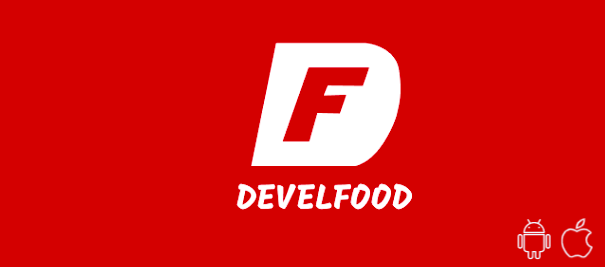

# 

<h4 align="center">
Projeto Develfood está em construção... 
</h4>

<h1>Sobre o projeto</h1>

Develfood é uma plataforma de entrega de comida pela internet

<h1>Funcionalidades</h1>
<ul>
  <li>Splash screen</li>
  <li>Navegação com barra inferior e em pilha</li>
  <li>Comunicação com APIs em todas as telas</li>
  <li>Cadastro e autenticação de usuário</li>
  <li>Validação em todos os campos e máscaras de CPF, telefone e CEP</li>
  <li>Preenchimento de campos de endereço automáticos após digitar CEP</li>
  <li>Lista de restaurantes com scroll infinito e pesquisa por nome</li>
  <li>Lista de pratos de cada restaurante com pesquisa por nome</li>
  <li>Lista de restaurantes com scroll infinito e pesquisa</li>
</ul>

<h1>Tecnologias</h1>
<ul>
  <li>React Native</li>
  <li>Typescript</li>
</ul>

<h1>Pré-requisitos</h1>
  <li>Node.js</li>
  <li>Git</li>
  <li>IDE Visual Studio Code (opcional)</li>

<h1>Licença</h1>

Este projeto está sobre a licença MIT

Made by Gustavo Lucas Sobbrero 

 
